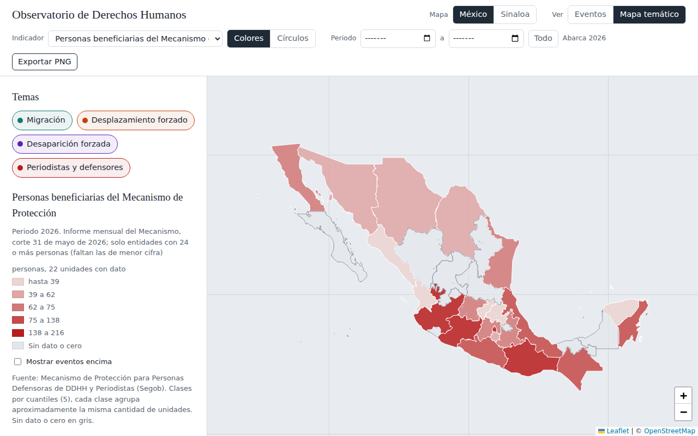

# Observatorio de Derechos Humanos

Mapa interactivo que reúne, en un solo sitio, registros georreferenciados sobre cuatro problemas de derechos humanos en México, con atención especial a Sinaloa. Los temas son migración, desplazamiento forzado interno, desaparición forzada y protección a periodistas y personas defensoras de derechos humanos. Cada registro conserva su fuente, su fecha y un nivel de verificación (fuente oficial, organización civil, trabajo de campo o prensa), de modo que el mapa distingue lo que consta en documentos oficiales de lo que solo aparece en una nota periodística. Además de los eventos puntuales, el sitio muestra indicadores por entidad y por municipio en mapas de colores o de círculos, un mapa del marco legal estatal de protección a periodistas y defensores, y permite exportar cualquier vista como imagen con leyenda, escala y créditos.

Es un sitio estático publicado con GitHub Pages. No requiere compilación ni servidor propio; los datos viven en archivos JSON que se capturan en Excel y se publican con scripts de Python.



## Estructura

| Archivo o carpeta | Contenido |
|---|---|
| `index.html` | Página única con el mapa y el panel lateral |
| `css/estilos.css` | Estilos |
| `js/config.js` | Temas, colores, rutas, niveles de verificación y datos para la cita |
| `js/app.js` | Lógica del mapa (capas, filtros, detalle, mapas temáticos) |
| `js/exportar.js` | Exportación a PNG con título, leyenda, norte, escala y créditos |
| `datos/eventos.json` | Eventos puntuales (marcadores) |
| `datos/fuentes.json` | Catálogo de fuentes |
| `datos/marco_legal.json` | Leyes, decretos, acuerdos y fiscalías estatales de protección a periodistas y defensores |
| `datos/indicadores/indice.json` | Lista de archivos de indicadores que carga la página |
| `datos/indicadores/<id>.json` | Un archivo por indicador, con su definición y sus valores (los que están vacíos esperan datos) |
| `datos/geo/estados.geojson` | 32 entidades (Marco Geoestadístico INEGI 2022, simplificado) |
| `datos/geo/sinaloa_municipios.geojson` | 18 municipios de Sinaloa (INEGI 2022, sin Eldorado ni Juan José Ríos) |
| `plantillas/eventos.xlsx` | Plantilla de captura de eventos (contiene los publicados) |
| `plantillas/marco_legal.xlsx` | Plantilla del marco legal (hojas de entidades e instrumentos) |
| `plantillas/indicador_<id>.xlsx` | Una plantilla por indicador |
| `herramientas/comun.py` | Funciones compartidas por los scripts |
| `herramientas/crear_plantilla_eventos.py`, `actualizar_eventos.py` | Plantilla y carga de eventos |
| `herramientas/crear_plantilla_indicador.py`, `actualizar_indicador.py` | Plantilla y carga de un indicador |
| `herramientas/crear_plantilla_marco_legal.py`, `actualizar_marco_legal.py` | Plantilla y carga del marco legal |
| `herramientas/crear_todas_las_plantillas.py` | Regenera todas las plantillas con los datos vigentes |
| `docs/indicadores.md` | Ficha metodológica de indicadores y fuentes |
| `docs/marco_legal.md` | Estructura y pendientes del marco legal |
| `docs/img/captura_mapa.png` | Captura de pantalla que aparece arriba |

## Flujo de captura

Todo se captura en Excel y se publica con un script. Cada script valida, escribe el JSON y deja un respaldo `.bak.json` (ignorado por git). Se ejecutan desde la raíz del repositorio.

```
python herramientas/actualizar_eventos.py plantillas/eventos.xlsx
python herramientas/actualizar_indicador.py plantillas/indicador_per_beneficiarios.xlsx
python herramientas/actualizar_marco_legal.py plantillas/marco_legal.xlsx
python herramientas/crear_todas_las_plantillas.py     # regenera las plantillas con los datos vigentes
```

Para crear un indicador nuevo se parte de una plantilla existente (`python herramientas/crear_plantilla_indicador.py <id_existente>`), se guarda el Excel con otro nombre, se cambian el id y los metadatos en la hoja "definicion", se capturan los valores y se corre `actualizar_indicador.py`; el script crea `datos/indicadores/<id>.json` y lo añade a `indice.json`. Un indicador con valores municipales lleva `cve_mun`; los valores sin `cve_mun` alimentan el mapa de México y los que lo traen, el de Sinaloa.

## Cómo agregar un evento a mano, sin Excel

Se añade un objeto a `datos/eventos.json` con esta forma.

```json
{
  "id": "ev-009",
  "tema": "desaparicion",
  "tipo": "búsqueda en campo",
  "fecha": "2026-01-15",
  "lat": 24.80, "lon": -107.39,
  "lugar": "Culiacán, Sinaloa",
  "titulo": "Título breve",
  "descripcion": "Qué pasó, según la fuente.",
  "fuente": "ceb-sin",
  "url": "https://...",
  "verificacion": "campo",
  "ejemplo": false
}
```

Los valores válidos de `tema` son `migracion`, `desplazamiento`, `desaparicion` y `periodistas`; los de `verificacion`, `oficial`, `organización`, `campo`, `prensa` y `sin verificar`. `fuente` debe coincidir con un `id` de `datos/fuentes.json`.

## Cómo agregar un valor de indicador a mano, sin Excel

En `datos/indicadores/<id>.json`, dentro de `valores`, se añade un objeto como este.

```json
{ "cve_ent": "25", "periodo": "2026-06-30", "valor": 0, "ejemplo": false }
```

`cve_ent` es la clave INEGI de la entidad (dos dígitos, Sinaloa es `25`). Para un valor municipal se añade `"cve_mun": "006"`.

## Estado de los datos

`datos/eventos.json` contiene registros reales de desplazamiento forzado tomados de prensa e informes (2021 a 2026, en Sinaloa, Chiapas, Guerrero, Michoacán, Chihuahua, Durango y Zacatecas), con nivel de verificación según quién dio la cifra. Las coordenadas de la mayoría son la cabecera municipal, así indicado en la descripción. También contiene 29 registros reales sobre periodistas y personas defensoras (2024 a 2026), entre ellos asesinatos y desapariciones documentados por ARTICLE 19, RSF, CPJ y CEMDA, casos de acoso judicial y agresiones por autoridades, cifras del Instituto de Protección de Sinaloa y de la Asociación 7 de Junio, e informes nacionales. El criterio de nombres es el de las organizaciones que documentan los casos, que nombran a las personas asesinadas o desaparecidas; las personas agredidas que siguen en activo no se nombran. Los eventos de migración y desaparición siguen siendo ejemplos.

`datos/indicadores/` incluye dos indicadores reales de desplazamiento, las personas desplazadas en 2025 por entidad (PDH Ibero, calculado a partir de porcentajes) y el porcentaje de población desplazada 2020-2025 (Encuesta Intercensal 2025, solo entidades con cifra publicada). En el tema de periodistas y personas defensoras hay tres indicadores reales, las personas beneficiarias del Mecanismo federal por entidad (corte mayo de 2026, 22 entidades), las agresiones a la prensa 2025 (ARTICLE 19, solo cinco entidades con cifra publicada) los periodistas asesinados por entidad en 2025 y 2026 (dos periodos, útil para probar el selector), y dos indicadores del informe 2025 de CEMDA sobre conflictividad socioambiental, los eventos de agresión contra personas defensoras ambientales (solo las cuatro entidades con cifra publicada) y las personas defensoras ambientales asesinadas por entidad (seis entidades). Las diez personas del memorial de CEMDA están cargadas como eventos. El resto son ejemplos.

## Marco legal estatal

`datos/marco_legal.json` tiene una entrada por entidad con su categoría (ley o mecanismo propio, coordinación con el Mecanismo federal, protección solo para periodistas, solo fiscalía o unidad, sin instrumento), la lista de instrumentos (nombre, tipo, año, URL, órgano que opera, nota) y un bloque `desglose` con campos en `null` reservados para los indicadores que se definan. El mapa lo toma como indicador categórico ("Marco legal estatal de protección") y, al hacer clic en una entidad, muestra sus instrumentos con enlace. La clasificación base es la de ISHR (corte 12 de abril de 2024) y se van añadiendo cambios verificados (Sinaloa 2025). El detalle está en `docs/marco_legal.md`.

## Mapas temáticos

La barra superior tiene dos filas. En la primera se elige el mapa (México por entidad, Sinaloa por municipio), la vista (eventos o mapa temático) y está el botón de exportar; en la segunda, el indicador con su forma (colores o círculos), la gama, el método y número de clases, la casilla de nombres y el periodo. Los controles que no aplican a lo que está dibujado aparecen atenuados. El indicador se puede activar en las dos vistas; en la vista de eventos se dibuja debajo de los marcadores, y en la temática los marcadores se ocultan salvo que se marque "Mostrar eventos encima". Un indicador se pinta por colores (coropleta) o por círculos proporcionales. Para la coropleta se eligen el método de cálculo de las clases (cuantiles, intervalos iguales, cortes naturales de Jenks o intervalos logarítmicos) y su número (3 a 7); la nota bajo la leyenda explica el método activo. La gama "Color del tema" usa el color del tema del indicador; las demás son escalas secuenciales de claro a oscuro, y en los indicadores categóricos asignan el tono más oscuro a la primera categoría.

En el panel lateral se elige un tema a la vez (o todos); la lista de indicadores se limita a los del tema elegido. Los límites de entidades y municipios se dibujan sobre el relleno temático y la casilla "Nombres" de la barra superior muestra el nombre de cada polígono encima del mapa; ambos salen también en la imagen exportada. Al hacer clic en una entidad, un municipio o un evento se abre una ventana sobre el mapa con el detalle, que respeta el tema y el periodo activos (solo lista indicadores del tema elegido y valores dentro del rango; el marco legal aparece con el tema de periodistas y defensores o con todos); la ficha de indicadores y esta guía se abren en esa misma ventana desde el pie del panel. El método por defecto son cinco clases por cuantiles; se ordenan las unidades con dato y cada clase recibe aproximadamente la misma cantidad de unidades. Se eligió como predeterminado porque los indicadores del observatorio son muy asimétricos (pocas entidades concentran la mayoría de los casos) y con intervalos iguales casi todo el mapa quedaría en la clase más baja. Cero y sin dato van en gris.

El selector de periodo (mes inicial y final) filtra los eventos por fecha. Sobre los indicadores conserva los valores cuyo periodo se traslapa con el rango y, si una unidad tiene varios, muestra el más reciente. Un valor anual ("2025") cubre todo el año; un valor con fecha ("2025-06-30") cubre ese mes. Los indicadores de existencias (padrones acumulados, marco legal) llevan `"acumulado": true` en su definición y siguen visibles aunque el rango empiece después de su fecha de corte; los de flujo (agresiones de un año) desaparecen fuera de su periodo.

La opción "Eventos registrados (conteo)" cuenta, dentro de cada polígono, los eventos visibles con los filtros activos.

Para tasas por 100 mil habitantes hará falta un indicador de población (CONAPO o Censo) y la vista correspondiente, pendiente en el código.

## Exportar a PNG

El botón "Exportar PNG" genera una imagen a doble resolución de la vista actual con título, subtítulo (mapa y periodo), leyenda, flecha de norte, barra de escala y créditos. No usa librerías externas; copia los mosaicos del mapa base desde la página y vuelve a dibujar polígonos y marcadores. El pie lista todas las fuentes activas en la vista (la del indicador y las de cada evento visible) y una línea "Cómo citar" con autor, año, título, fecha y dirección de la página. El autor y la dirección se configuran en `js/config.js` (`sitio`); si la dirección se deja vacía se usa la de la página publicada. Para que el navegador permita copiar los mosaicos, el proveedor del mapa base debe aceptar CORS (OpenStreetMap y CARTO lo hacen). Si se cambia a otro proveedor y la exportación falla, esa es la causa.

## Pendientes

- Tasas por 100 mil habitantes (requiere un indicador de población).
- Actualizar el GeoJSON de Sinaloa con los 20 municipios cuando INEGI publique el marco con Eldorado y Juan José Ríos.
- Línea de tiempo y gráficas por indicador.
- Exportación de los datos filtrados.
